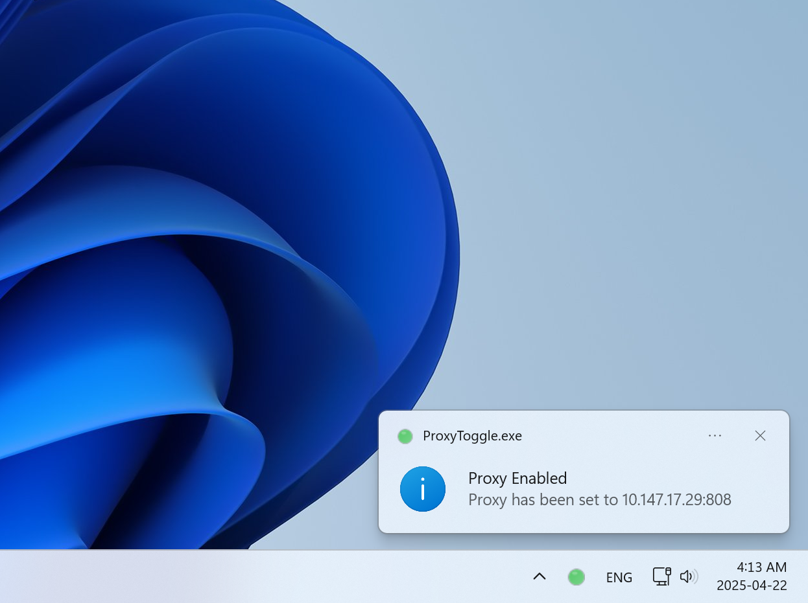

# Windows Proxy Toggle Tool

A lightweight system tray utility that lets you toggle Windows proxy settings with a single click. Never navigate through multiple settings screens again!

## Features

- Toggle proxy on/off with a single click
- Color-coded system tray icon (green = enabled, red = disabled)
- Customizable proxy server, port and exceptions
- Runs in the system tray for minimal interference
- Standalone executable with no dependencies

## Overview

This tool creates a system tray icon that shows your current proxy status at a glance. Left-click to toggle the proxy on or off instantly, or right-click for more options including customizing your proxy settings.

Perfect for developers, IT professionals, or anyone who frequently switches between proxy and direct connections.

## Installation

Simply download the ProxyToggle.exe from [release](https://github.com/gludemy/ProxyToggle/releases) and run it. No installation required.
> [!WARNING]
> If you're on Windows 11, Windows Security may flag this executable as suspicious and quarantine it. This occurs because the executable is not digitally signed, not because it contains malicious code. If you're concerned about security, you can build the executable from source code yourself by following the instructions below.

For those who want to customize or build from source, the complete PowerShell script is included. Follow below steps to build from source code.

1. Create an empty folder on your computer
2. Download [ProxyToggle.ps1](https://github.com/gludemy/ProxyToggle/blob/main/ProxyToggle.ps1) and [ProxyToggle.ico](https://github.com/gludemy/ProxyToggle/blob/main/ProxyToggle.ico) and save them to your folder.
3. Open PowerShell as administrator and navigate to the folder
4. Run the following command: 
`Invoke-ps2exe -InputFile ProxyToggle.ps1 -OutputFile ProxyToggle.exe -IconFile ProxyToggle.ico -NoConsole -NoOutput -NoError`
5. The ProxyToggle.exe will be generated in your folder
